# AI-Powered Video Timeline Automation

Shorts and reels are a necessary evil of our age. You have an amazing 2-hour-long podcast—great. But if you want more people than your aunt to see it, you need a dopamine-kicker teaser. 
Now, going from those 2 hours to 150 seconds is a pain in the ass.

But hey, it's 2025: the year AI magically solves our life problems. 
So, everyone is selling you the magic pill: "1 long video, 10 viral clips. Create 10x faster."

I tried those and I don't like them. 

They kind of work, get you about 60% there. But when you try to finish that remaining 40%, it becomes a nightmare.

In this project, I'll show you how you can hand off the boring part to AI—finding good clips. And then you take control, import it directly into DaVinci Resolve, and do your magic there.

High-quality videos, full control, fast and free.

If you're up for it, let's get going.

# Main Steps of the Workflow

1. Starting point: transcript of your long-form video with timestamps
2. Call an AI model to select the clips for a ~120s video using a fully custom prompt
3. Create a `.otio` timeline you can import into your NLE (DaVinci Resolve, Premiere, etc.)

# Workflow diagram

```mermaid
graph LR
    A[Clone repo<br/>Install deps<br/>Create .env] --> B[Copy config.example.py to config.py<br/>Fill paths and params]
    B --> C[Load config and .env in main.py]
    C --> D[Read transcript<br/>data/transcripts]
    D --> E[Build prompt<br/>ai_prompts/prompts.py]
    E --> F[Call AI model<br/>Gemini or OpenAI]
    F --> G[Parse structured clips<br/>ClipsList]
    G --> H[Save clips JSON<br/>data/ai_selected_clips]
    H --> I[Convert timestamps to frames<br/>to_clip_spec at FPS]
    I --> J[Create SourceMedia list<br/>MEDIA_PATHS]
    J --> K[Build OTIO timeline<br/>PerMediaTimelineBuilder]
    K --> L[Write OTIO file<br/>data/timelines]
    L --> M[Import OTIO into NLE<br/>DaVinci or Premiere]
```

# What You Need to Do

## Setup

1) Clone the repo  
`git clone https://github.com/<your-org>/automate-timelines.git && cd automate-timelines`

2) Create config  
`cp config.example.py config.py` and fill in transcript filename, context, FPS, media paths, and output names.

3) Add secrets  
Create a `.env` file with `GOOGLE_API_KEY=<your key>` (and `OPENAI_API_KEY=<your key>` if using OpenAI).

## Install Dependencies

**Using uv (recommended)**  
- Install uv if needed: `curl -LsSf https://astral.sh/uv/install.sh | sh`  
- From the repo root: `uv sync`  
- Activate the venv: `source .venv/bin/activate`

**Using pip**  
- Create a venv: `python -m venv .venv && source .venv/bin/activate`  
- Install: `pip install -r requirements.txt` (if present)

## Inputs to Change in `config.py` (copy `config.example.py` first)

1. Copy `config.example.py` to `config.py`
2. Paste your `GOOGLE_API_KEY` (and `OPENAI_API_KEY` if you use OpenAI) in `.env`
3. Place your transcript file in `data/transcripts` and set `TRANSCRIPT_FILE_NAME`
4. Update `CONTEXT` to describe the show/episode you are clipping
5. Set `FPS` to match your footage
6. Add absolute paths to your video files in `MEDIA_PATHS`
7. Rename `TIMELINE_FILENAME` to the timeline you want to generate

# Building Blocks

## AI Calls (folder `ai_examples`)

- `load-api-checks.py`: minimal example to load `.env` and verify an API key is present.
- `0-structured-ouput.py`: OpenAI example returning a Pydantic model (CalendarEvent) to demonstrate structured output.
- `0.1-example-orchestrator.py`: orchestration pattern (plan → write → review) showing structured outputs and logging for a blog-writing flow.
- `0.2-structured-ouput-gemini.py`: Gemini example producing a structured recipe via JSON schema; shows both dict config and typed `GenerateContentConfig`.

## Data Models

- `models/data_models.py`: Pydantic models for clips (`Clip`, `ClipsList`, `ClipSpec`, `SourceMedia`, etc.) and helpers such as `to_clip_spec(FPS)` to convert timestamp ranges to frame ranges used in timelines.

## Orchestrator (main workflow in `main.py`)

1. Load environment variables and read the transcript from `data/transcripts`.
2. Build the orchestrator prompt (`ai_prompts/prompts.py`) with `CONTEXT` and the transcript from `config.py`.
3. Call Gemini (or OpenAI) to get structured clip selections parsed into `ClipsList`.
4. Log and save the AI-selected clips to `data/ai_selected_clips/<timeline>.json`.
5. Convert timestamp clips to frame-based specs (`ClipSpec`) using `FPS`.
6. Create `SourceMedia` entries for each video in `MEDIA_PATHS`.
7. Build an OTIO timeline with `PerMediaTimelineBuilder` and write it to `data/timelines/<timeline>.otio`.

## Timeline Creation (folder `create_timelines`)

- `otio_builder.py`: used in the main workflow; builds an OTIO timeline with paired video/audio tracks per media and places clip ranges on those tracks.
- `build_simple_timeline.py`: basic OTIO example that creates a single-track timeline from hardcoded media/time ranges—good for understanding OTIO primitives.
- `timeline_config_example.json`: example JSON shape for timeline configuration.

## Timestamp Utilities

- `utils/utils.py`: Converts transcript timestamps (`HH:MM:SS,mmm`) to seconds; useful when mapping transcript timecodes to frame counts.

# Run the Example Workflow

1) Ensure `config.py` and `.env` are set.  
2) Place your transcript at `data/transcripts/<your-file>.txt` and media files at the paths in `MEDIA_PATHS`.  
3) Run: `python main.py`  

Outputs:  
- AI-selected clips JSON at `data/ai_selected_clips/<timeline_name>.json`  
- OTIO timeline at `data/timelines/<timeline_name>.otio` (import into DaVinci Resolve or another OTIO-aware NLE).

## Project Layout (Key Files)

- `main.py` — orchestrates the workflow: load transcript, call Gemini/OpenAI, convert timestamps to frames, build OTIO timeline.
- `config.py` — user-specific settings (copied from `config.example.py`).
- `ai_prompts/prompts.py` — orchestrator prompt template.
- `models/data_models.py` — Pydantic models for clips and source media.
- `create_timelines/otio_builder.py` — builds per-media OTIO timelines.
- `data/` — transcripts, AI-selected clips, and generated timelines.
- `ai_examples/` — example scripts for AI calls and structured outputs.
